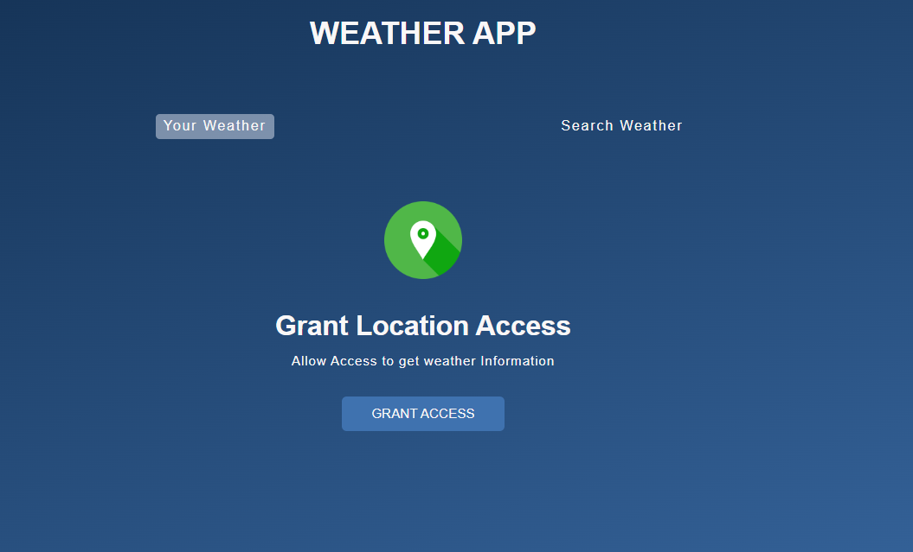
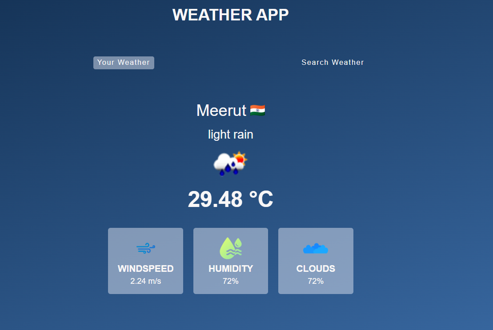
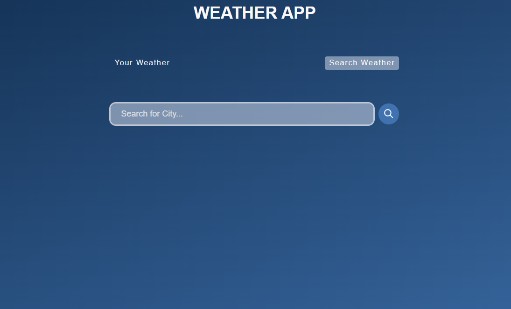

# Weather Application

This is a simple Weather Application built using HTML, CSS, and JavaScript, powered by the OpenWeather API. The app allows users to view current weather information based on their current location or they can search for weather details by city name.

## Table of Contents
- [Features](#features)
- [Setup and Run Instructions](#setup-and-run-instructions)
- [Usage](#usage)
- [Assumptions and Decisions](#assumptions-and-decisions)
- [Screenshots](#screenshots)
- [API Reference](#api-reference)
- [Technologies Used](#technologies-used)


## Features

- **Your Weather**: Fetches weather data based on the user's current location, after receiving location permission.
- **Search Weather**: Allows users to search weather by city name.
- Displays key weather parameters such as temperature, windspeed, humidity, and cloudiness.
- Displays icons representing the weather conditions, the country flag of the location, and a loading screen while fetching data.

## Setup and Run Instructions

1. **Clone the repository**:
    ```bash
    git clone https://github.com/KamalSagar/Weather_Application.git
    ```

2. **Navigate to the project directory**:
    ```bash
    cd weather-app
    ```

3. **API Key**:
    - Obtain an API key from [OpenWeather](https://openweathermap.org/).
    - Replace the `API_KEY` variable in `index.js` with your own API key:
      ```javascript
      const API_KEY = "your-api-key-here";
      ```

4. **Run the application**:
    - Open the `index.html` file in a browser to view the application.

## Usage

- **Your Weather**: On first visit, the app will ask for location access. Click "Grant Access" to allow location access and get the weather of your current location.
- **Search Weather**: Use the search form to type in the name of a city and view the current weather information for that city.

### Interaction
- The application contains two tabs: "Your Weather" and "Search Weather."
    - In **Your Weather**, you can see the weather at your current location.
    - In **Search Weather**, you can manually search for the weather of any city by entering the city name.

## Assumptions and Decisions

1. **Geolocation support**:
   - The app assumes that the browser supports geolocation. If geolocation is not supported or access is denied, the "Grant Location Access" screen is shown.
  
2. **Session storage**:
   - The user's location coordinates are stored in session storage, allowing faster retrieval of weather information without repeatedly asking for location access.
  
3. **Error handling**:
   - The app assumes that if the OpenWeather API fails to return data or if the city is not found, it will show an appropriate alert message to the user.
  
4. **Temperature units**:
   - The app uses metric units (Celsius) for displaying temperature and windspeed.

## Screenshots

|  |
|------------------------------------------------------|

|  |  |
|------------------------------------------------------|----------------------------------------------------------|

## API Reference

- **OpenWeather API**:
  - [Current Weather Data API](https://openweathermap.org/current)
  - To fetch weather data, the app makes GET requests to the OpenWeather API using the following endpoints:
    - Geolocation-based weather: 
      ```
      https://api.openweathermap.org/data/2.5/weather?lat={lat}&lon={lon}&appid={API_KEY}&units=metric
      ```
    - City-based weather: 
      ```
      https://api.openweathermap.org/data/2.5/weather?q={city}&appid={API_KEY}&units=metric
      ```

## Technologies Used

- **Frontend**: HTML, CSS, JavaScript
- **Weather Data API**: [OpenWeather API](https://openweathermap.org/)
- **Icons and Images**: Icons are sourced from OpenWeather and custom assets for weather parameters.


